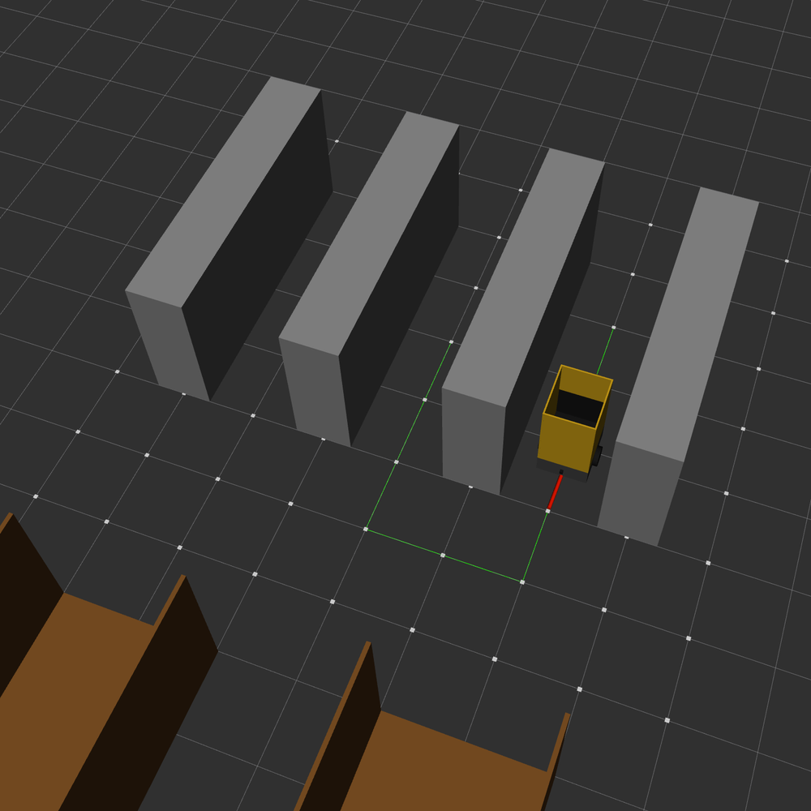
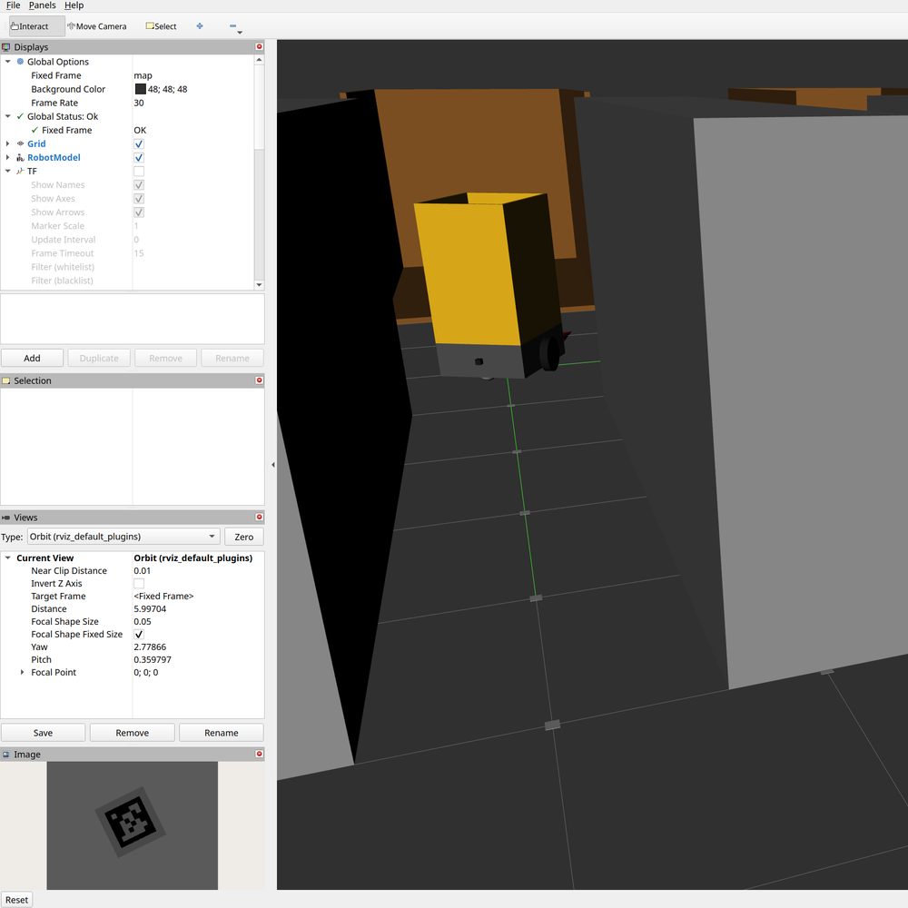

# Warehouse

A simulated warehouse environment where a fully autonomous robot receives orders, drives to each item's location, and receives it. 
|  |  |
|:---:|:---:|

## Installation
### 1. Install system dependencies
This project uses ROS2 Jazzy Jalisco and Gazebo Harmonic. You can install them on your host machine, use the official [ROS2 Jazzy Docker Image](https://hub.docker.com/_/ros/), or use WSL. 

Refer to [this guide](https://docs.ros.org/en/jazzy/Installation.html) on how to install ROS2 and [this guide](https://gazebosim.org/docs/harmonic/install_ubuntu_src/) on how to install Gazebo.

### 2. Setup a workspace
Create a workspace directory to house the source files.
```bash
mkdir -p warehouse_ws/src
```

### 3. Clone this repository
```bash
cd warehouse_ws
git clone https://github.com/ozziexyz/warehouse src/warehouse
```
### 4. Install package dependencies
```bash
sudo apt update
rosdep update
rosdep install --from-paths src --ignore-src -r -y
```
Make sure to run the last command in your workspace directory.
### 5. Build packages
```bash
colcon build --symlink-install
```
Run this in the workspace directory as well. A VSCode default build task configuration is also provided if you want to quickly build the workspace with `ctrl + shift + B`. 
### 6. Source workspace 
```bash
source install/setup.bash
```
Run this command in every terminal you plan to use with the project. Alternatively, you can add it to your `.bashrc`.

## Overview
### Goal
Simulate a robot that moves autonomously through a small mock-warehouse environment to receive boxes. The robot can only use simulated sensors to navigate, and does not know its own true position or velocity. Upon retrieving all the items in an order, the robot unloads the contents into a truck bed and queues the next order* (WIP).

### Package Structure

**warehouse_sim**

This package contains a world SDF, the robot's URDF, model files for simulation assets, launch files, and various configuration files. It also contains scripts that publish obstacle markers for RViz, spawn boxes, generate XML for the AprilTag grid, and publish the robot's ground truth pose frame.

**warehouse_control**

All of the navigation logic is housed in this package. It includes a `navigation_manager` node that combines path planning and path following into a single action server. The `path_planner` node uses the A* algorithm to find a viable path between the robot's current position and a goal pose based on the warehouse layout. If a path is found, `navigation_manager` calls the `sm_controller` node's action service. This node uses a state-machine based algorithm to accurately follow the desired path. Additionally, there is a launch file that runs these nodes and provides necessary arguments. 

**warehouse_perception**

To know where it is in the warehouse, the robot uses a grid of AprilTags distributed evenly on the floor. The robot uses a downward facing camera sensor to see the tags and get a global pose estimate. The `apriltag_node` from the `apriltag_ros` package is used to do the detection and calculate the `camera_link -> tag` transform. Once this transform is obtained, the `apriltag_localization` node uses it to calculate the robot's global pose based on the tag's known position in the `map` frame. The `apriltag_node` needs the camera's intrinsics and a rectified image to work properly. Since the Gazebo sim sensor does not publish this data, the `rectify_node` from the `image_proc` package and the `static_camerainfo_publisher` node from `warehouse_perception` are used. 

**warehouse_order**

Currently, this package only contains a single node: `order_manager`. This node subscribes to the `/order` topic and receives lists of warehouse locations as `std_msgs/Int32MultiArray` messages. Upon receiving a message, the `order_manager` either queues the order if another order is currently being fulfilled or just immediately executes it if not. To fulfill the order, it sequentially sends action goals for each item in the list to the `navigation_manager`. When the goal is reached, it requests a box to be spawned above the robot.

**warehouse_interfaces**

This package holds action and service message types for nodes in the other packages to use. 